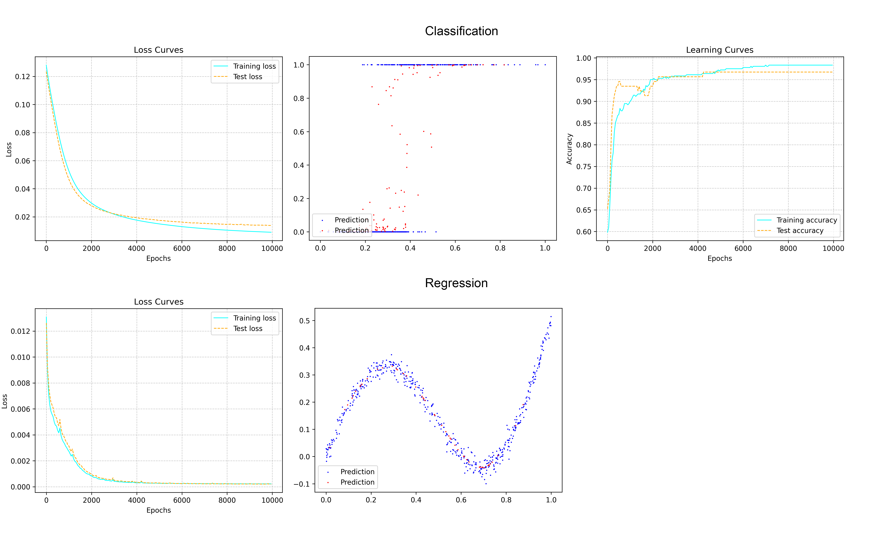
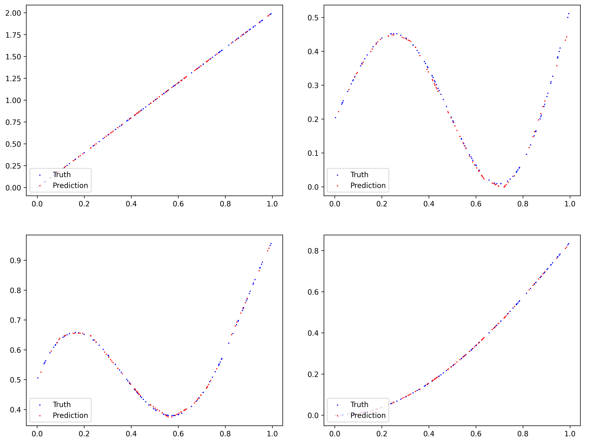

# Multilayer Perceptron


## 📌 Requirements

These projects are mainly built with Python, while a few use Rust. Therefore, some dependencies are required.  

Each project includes a `venv.sh` and `requirements.txt` to help you set up a virtual environment and install the necessary packages:  

```bash
bash venv.sh
source venv/bin/activate
```

Note: The projects were developed on linux (ubuntu).
If you are using WSL, some visualization scripts may not work properly due to the lack of GUI support.


## 📌 Projects

### Neural Network ✅

Neural Network is implemented as an encapsulated class in Python,  
capable of solving both regression and classification tasks.  
The design goal is to provide a reusable and modular implementation.

#### 📖 Features

Algorithm from scratch → implemented without high-level ML libraries, only using NumPy for matrix operations.

Training methods → supports Stochastic Gradient Descent (SGD) and mini-batch training.

Visualization → includes real-time animations to track the learning process.

Configurable architecture → adjustable network shape, activation functions, max iterations, learning rate, batch size, etc.

Data handling → built-in data loading and preprocessing pipeline.

#### 📖 Programs 
  - Train and Predict

    Before started, you need to install numpy, matplotlib, pandas, venv.sh is provided to simplify this. We recommand you to use --help before the first usage.

    Note: The load datacsv for regression tasks is still in progress, a test case is currently provided. An json config file to pass network structure is planned in the future.

      ```
      Usage:

        python  mlp.py  <--options> <config.json> <data.csv> [params.json]

      Options:

        -s:  Split dataset into (train.csv) and (test.csv), no params required

        -t:  Train dataset, if params.json is provided, it performs fine tuning.

        -p:  Test on a test dataset, if params.json is provided, it performs prediction based on trained model.

        -help:  Show help messages.

        -More features to come.

      Note:

        There is built in dataset generated by script, use --gen-data1d to replace dataset
      ```
    The program will:

    Defines the network structure (layers, activation functions).  

    Trains using backpropagation and gradient descent.  

    Visualize loss and prediction:

      By default, regression task will visualize the loss, and the data distribution for first dimension.

      In addition, classification task will add an accuracy plot.


#### Demo
The example graph on both classification and regression.



#### Dataset

A dataset is provided in this repository, corresponding to breast cancer diagnosis classification.
It contains 32 columns, where the diagnosis column is the label to predict. The label can take two values:

M → Malignant (cancerous)

B → Benign (non-cancerous)

The remaining 30 numerical features describe various characteristics of a cell nucleus extracted with fine-needle aspiration (FNA), such as radius, texture, perimeter, area, and smoothness. These measurements are widely used for early breast cancer detection.

For this project:

It is split into two parts: one for training and one for validation/testing.

The objective is to build a classification algorithm that predicts whether a tumor is malignant or benign based on the given features.


#### 📖 Class 

Example: Train and Test a Neural Network

Below is a simple example of using the `NN` class to train a regression model.

```python
from Neural_network import NN, relu, generate_data_rand
from Data_process import load, preprocess_data

def main():
    try:
        # Define network structure: input → 64 → 32 → output
        net_shape = (1, 64, 32, 1)
        activation_funcs = (relu, relu, None)  # last layer is linear (regression)

        # Initialize neural network
        nn = NN(net_shape, activation_funcs)

        # Generate training data
        inputs, truths = generate_data_rand(142, 500, 0.02)
        test_inputs, test_truths = generate_data_rand(123, 50, 0.02)
        nn.train(inputs, truths, 10000, 0.005, batch_size=20, animation="plot")

        # Test with new data
        nn.test(inputs, truths, test_inputs, test_truths)

        # Save graphs
        nn.save_plots()

    except Exception as e:
        print("Error:", e)


if __name__ == "__main__":
    main()
```

#### 📖 Generalization

The figure shows that neural networks are capable of learning non-linear patterns from different datasets and can generalize beyond the training data, making them applicable to a wide range of tasks.



---


## License
This project is licensed under the MIT License - see the [LICENSE](LICENSE) file for details.
